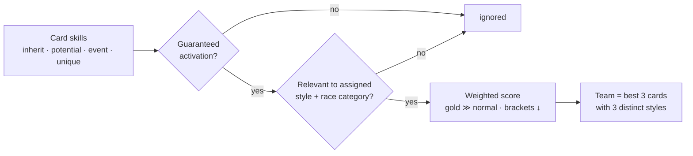

<div align="center">

# Uma Team Trials Builder

**Build optimal [Team Trials](https://gametora.com/umamusume/team-trials-pvp-scoring) teams in _Uma Musume: Pretty Derby_ from the characters on your account — and see exactly what the [top 100 ranked players](#-top-100-meta--what-the-best-actually-run) actually run.**

[](https://github.com/DualChimerra/TeamTrials_Builder/actions/workflows/deploy.yml)
[](https://github.com/DualChimerra/TeamTrials_Builder/actions/workflows/update-data.yml)


### 🐎 **[Open the app →](https://dualchimerra.github.io/TeamTrials_Builder/)**

</div>

---

## Why this exists

Team Trials scoring is unusual. Two things dominate a team's score:

- **Guaranteed-activation skills.** Skills that always fire bank reliable points every race, and
  **gold skills are worth ~2.4× a normal skill**. A horse stuffed with relevant guaranteed skills
  out-scores a flashier one whose skills rarely trigger.
- **Distinct running styles.** Two horses on the same style fight each other for positioning
  bonuses — duplicating a style throws away **~4 000 points**. So a good team runs **three
  different styles**.

This tool encodes those rules. You tell it what you own; it tells you the best teams and **why**.

## Features

| | |
|---|---|
| 🗂️ **Roster tracking** | Mark owned cards, **stars (★)**, **potential level (1–5)**, with search & filters. Saved in your browser. |
| 🏇 **5 teams** | Suggests 3 horses for each race category: **Sprint / Mile / Medium / Long / Dirt**. |
| 🎯 **Smart assignment** | Picks **3 distinct running styles** per team and assigns each horse the style (aptitude ≥ your threshold) where its skills score best. |
| 🥇 **Skill-tier scoring** | Only guaranteed-activation white/gold skills count: golds ≫ normals, lower-priority ("bracketed") skills discounted. Uniques and raw aptitude grades are **not** scored. |
| 🔄 **Quick Change** | Each slot has a dropdown of the next best-fitting horses (sorted by score) to swap in manually. |
| 🔁 **Unique-across-teams toggle** | Keep every horse to one team (real Team Trials rules), or allow reuse. |
| 🔒 **Locks** | Exclude a horse globally or per race category. |
| 🧪 **Event-skill toggle** | Count training-event skills or ignore them. |
| 💡 **"Why this horse?"** | Every pick explains its matched skills (origin · tier · reason) and the full score math. |
| 🏆 **Top-100 meta** | A dedicated tab showing what the **top 100 ranked players** actually field — per race & running style. *(see below)* |
| ✨ **Meta-aware swaps** | Horses popular in the top-100 are tagged **Meta #N** right in the swap dropdown, with an optional "prioritize meta" mode. |

## 🏆 Top-100 meta — what the best *actually* run

Most team builders score horses in a vacuum. This one goes further: it analyzes the **real teams of
the 100 highest-ranked Team Trials players** and turns them into a meta breakdown you can act on.

For **every race × running style** (Sprint / Mile / Medium / Long / Dirt × Front / Pace / Late / End) it shows:

- 🐎 **Most-used horses** — ranked by how many of the top 100 field them there, with usage %.
- 🎴 **Support-card builds** — the actual support cards the top players trained those horses on.
- 📊 **Average stats** — the real Speed / Stamina / Power / Guts / Wisdom the top teams hit.
- ⚡ **Most-used skills** — the guaranteed-activation skills that win at the top, by frequency.

And it feeds back into team-building: in the swap dropdown, top-100 picks are flagged **Meta #N**, so
you can match the meta using **the horses you already own**.

> As far as we know, **no other Team Trials tool surfaces the live top-100 like this** — usage,
> builds, supports, stats and skills, broken down by race and style. The meta dataset
> ([`public/data/tt_meta.json`](public/data/tt_meta.json)) is aggregated, fully anonymous (counts only),
> and refreshed from the current top 100 global ranking.

## How a horse is scored



- **Guaranteed lists** (general / per-style / per-distance / Trick) — [`src/scoring/guaranteedSkills.ts`](src/scoring/guaranteedSkills.ts)
- **Matcher & weights** (normalises `◎/○` badges, drops `×` debuffs, matches official `name_en`) — [`src/scoring/classify.ts`](src/scoring/classify.ts)
- **Team-assignment search** (per category, optional uniqueness across teams) — [`src/scoring/optimizer.ts`](src/scoring/optimizer.ts)

## Tech

React + TypeScript + Vite + Tailwind v4, Zustand state, fully static (no backend), deployed to
GitHub Pages via Actions.

```bash
npm install
npm run dev      # http://localhost:5173/TeamTrials_Builder/
npm run build    # production build → dist/
```

## Data & auto-updates

The dataset ([`public/data/dataset.json`](public/data) + `skills.json`) is generated from
**gametora's English (global) game data** plus the community **`master.mdb`** (for potential
unlock ranks), and committed so the app needs no network at build time.

A scheduled GitHub Action ([`update-data.yml`](.github/workflows/update-data.yml)) re-pulls the
data **weekly**, so **new global horses and skills appear automatically** — gametora tags each
card with its global release date, and the Roster's *Global (EN) only* filter picks them up.

Support-card names ([`public/data/supports.json`](public/data)) come from the same gametora data
layer. The **top-100 meta** ([`public/data/tt_meta.json`](public/data)) is an aggregated, anonymous
snapshot (usage counts per race & style — no player identities) of the current global top 100.

Refresh manually any time:

```bash
bash scripts/fetch_raw.sh     # re-download raw data + rebuild public/data
# or rebuild from existing data/raw:
python3 scripts/build_dataset.py
```

<details>
<summary>Data field reference</summary>

- `aptitude` order: `[turf, dirt, short, mile, medium, long, front, pace, late, end]`
- skill `rarity`: `1` normal (white) · `2` gold · `3/4/5` unique · `6` evolution
- potential `rank`: `0` inherit (innate) · `1–5` awakening / talent level

</details>

## Disclaimer

Unofficial fan tool. *Uma Musume: Pretty Derby*, all game data, and images are © Cygames.
Not affiliated with or endorsed by Cygames. Character art and skill icons are loaded from
[gametora.com](https://gametora.com/umamusume).
